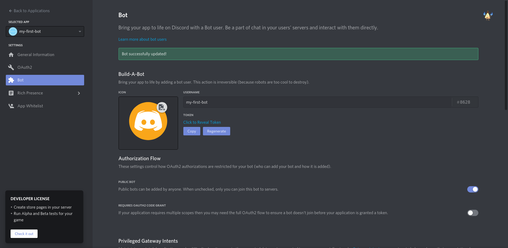
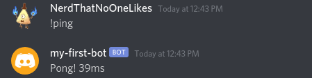

# Getting Started

Before touching **Gencord**, it is **extremely** important you have a basic knowledge of **JavaScript**, and **Node.js**. If you do not learn it before using Gencord, it will be a lot harder to create a discord bot. In case you are unfamiliar with JavaScript then here are some resources.

- [Eloquent JavaScript](https://eloquentjavascript.net/)
- [MDN's Guide and Documentation](https://developer.mozilla.org/en-US/docs/Web/JavaScript)

## Setting up

Requirements

- [Node.js](https://nodejs.org/en/) v14 or higher
- [npm](https://npmjs.com)
- Basic knowledge of JavaScript

**Node.js** is a runtime for **JavaScript**, which allows you to execute JavaScript outside of the browser. Visit the Node.js website, and download it. When you install Node, **npm** will be installed with it.

## Creating and setting up a project

To get started, you need to set up a folder for your project. Using software known as a `terminal`, you can execute certain commands that control your system.

To access the terminal, if you're on **macOS** or **Linux**, open up the `Terminal` application. If you are on **Windows**, open up the `Command Prompt` application.

```bash
$ mkdir my-first-bot
```

The `mkdir` command creates a folder, also known as a `directory`. This will be the folder for your project.
above the mkdir
Open up the terminal if your on MacOS or Linux, If on Windows open powershell.

```bash
$ cd my-first-bot
```

The `cd` command changes the current folder you are in, and in this case you are changing the folder to the `my-first-bot` folder. Now, when you execute commands in this folder, it will effect the `my-first-bot` folder.

```bash
$ npm init -y
```

After running the `npm init -y` command, you will notice that a file called `package.json` has been generated. This file contains data about your project, such as the name, description, version, and scripts to run.

```bash
$ npm install gencord
```

Finally, you have to install the **Gencord** library. You will also notice that you have a `node_modules` folder, and `gencord` has been added as a dependency to your `package.json` file. If this is the case, everything went successful.

## Creating your Bot App

Before writing code for your bot, you need to create your actual bot app, and invite it to your discord server. To create it, head to [https://discord.com/developers](https://discord.com/developers/applications), and click `New Application`, and give it a name. This will be your bot's name. Afterwards, you should see a screen like this: 

After that, head to the `OAuth2` tab, and under `scopes`, select `bot`. This will tell Discord that your application is a bot. You should see a section pop up underneath, for permissions. Select `Administrator`, so that your bot has all the permissions to function correctly, and then copy the link under `scopes`. This will be the link to invite your bot to your discord server. Paste the link in a new tab, authorize yourself, and the bot should be in your server, but offline. Let's see how we can add some functionality to it, and get it up online.

## Writing code

Now, we can start writing code! Proceed to create a file called `index.js` in the root of your project folder. This is where you will write your code.

Open your folder inside of your code editor of choice, here are some popular options! [Visual Studio Code](https://code.visualstudio.com/), [Sublime Text](https://www.sublimetext.com/) and [Atom](https://atom.io/)

Now, open up the `index.js` file you made earlier, and type the following code.

```js
// Requires the Client and message class
const { Client, Message } = require("gencord");

// Creating a new instance of a gencord client
// the status can be "dnd", "online", "idle" or "invisible"
const client = new Client({
  token: "Your token",
  intents: 513,
  status: "dnd",
});

// Listening for when the bot logs in
client.on("READY", () => {
  console.log("Ready!");
});

client.on("MESSAGE_CREATE", (messageData) => {
  // creating a new instance of a gencord message class
  const message = new Message(messageData, client);

  // check if the message was "!ping"
  if (message.content === "!ping") {
    // Send a message to the channel that the message was sent in
    message.channel.send(`Pong! ${client.ping()}MS`);
  }
});
```

Now navigate back to your server and type in a text channel `!ping`.

<br>
If you did everything correctly, you should see the bot reply, and the ping of the bot.

## Command Handler

You could just continue making your bot like this, but it's not a great idea, as in programming, it is a bad practice for everything to be in 1 file. Instead, you can create a `command handler`, which will allow you to create different commands in different files, making everything a lot cleaner. In this section, you will learn how to create a simple `command handler` for your bot.
